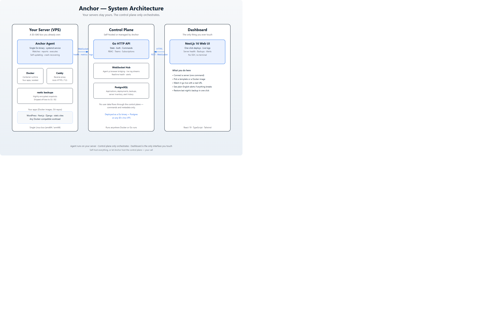
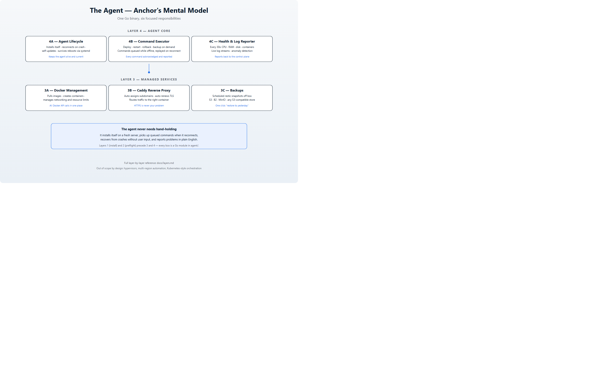

<picture>
  <source media="(prefers-color-scheme: dark)" srcset="docs/assets/readme/hero-banner.svg">
  
</picture>

<p align="center">
  
  
  
  
  
  
  
  
</p>

<p align="center"><strong>You already have a server. Anchor turns it into your own private Heroku — deploy in one click, and if anything breaks, the agent fixes it or tells you exactly why in plain English.</strong></p>

---

## What Anchor is

Anchor is a self-hosted mini-cloud platform with three parts:

- **You bring the hardware** — any VPS, dedicated box, or old laptop running Linux. It can cost $5/month. It stays yours.
- **A lightweight Go agent lives on it** and turns the box into a self-managing private cloud: Docker, automatic HTTPS, daily backups, health monitoring, log streaming, self-repair.
- **A web dashboard is the only thing you ever touch.** No SSH. No terminal. No reverse-proxy configs.

| Capability | How it works |
|---|---|
| 🚢 **One-click deploys** | Templates (WordPress, Next.js + Postgres, Django + Postgres, static) or any Docker image / Git repo |
| 🔒 **Automatic HTTPS** | Caddy is embedded in the agent — real domains and TLS certificates appear with zero configuration |
| 💾 **Daily backups** | restic snapshots to S3 / Backblaze B2 / any S3-compatible store, with one-click "restore to yesterday" |
| 📊 **Health monitoring** | CPU, RAM, disk, container status, and network rates reported every 30 seconds |
| 🖥️ **Live logs** | Stream any container's logs in the dashboard in real time over WebSocket |
| 🛟 **Plain-English alerts** | "Your disk is almost full" — not a 400-line stack trace |
| 🧠 **Anchor Infer** | Deploy OpenAI-compatible LLM endpoints on Arm64 (quantized GGUF, arch-aware images, before/after bench card) |

## Who Anchor is for

Small agencies, freelance developers, and small businesses who:

- Already have (or can afford) a $5–$40/month server
- Don't want to hire a sysadmin or learn Linux/Docker/nginx
- Are currently either paying too much for managed cloud, or manually babysitting their own VPS

### Why not just use X?

| Tool | Strength | Gap |
|---|---|---|
| Coolify | Full-featured, active | UI still assumes technical comfort |
| CapRover | Simple, mature | Dated UI, smaller community |
| Dokku | Rock solid | Command-line only, no dashboard |
| Railway / Render | Great UX | You don't own the servers — their cloud, not yours |

Anchor's wedge:

1. **Built for non-sysadmins.** No assumption that you know what a reverse proxy or an SSH key is.
2. **Peace of mind by default** — automatic backups and plain-English alerts are baseline, not add-ons.
3. **Your servers stay yours.** The control plane only orchestrates; workloads and data never leave hardware you own.

## Architecture

<picture>
  <source media="(prefers-color-scheme: dark)" srcset="docs/assets/readme/architecture.svg">
  
</picture>

| Layer | Technology | Role |
|---|---|---|
| Agent | Go static binary | Runs on your server as a systemd service |
| Container runtime | Docker | Isolates and runs every workload |
| Reverse proxy / TLS | Caddy (embedded via its admin API) | Domains and HTTPS certificates, automated |
| Backups | restic | Encrypted, deduplicated, off-box snapshots |
| Control plane API | Go HTTP server | Auth, command dispatch, subscription enforcement |
| Database | PostgreSQL (SQLite for local dev) | Source of truth for users, servers, deployments, alerts |
| Realtime | WebSockets | Agent ↔ control plane ↔ browser bridging |
| Dashboard | Next.js 16 · React 19 · TypeScript · Tailwind v4 | The only interface you ever touch |

## Inside the agent

<picture>
  <source media="(prefers-color-scheme: dark)" srcset="docs/assets/readme/agent-layers.svg">
  
</picture>

One Go binary with three active responsibilities and three service managers:

- **4A – Agent Lifecycle.** Persistent WebSocket to the control plane with automatic reconnect and exponential backoff; self-update with checksum verification and atomic binary swap; survives reboots via systemd.
- **4B – Command Executor.** Deploy, rollback, restart, backup — every command acknowledged, executed, and reported. Commands received while offline are queued and replayed on reconnect.
- **4C – Health & Log Reporter.** Every 30 seconds: CPU, RAM (`MemAvailable`-based), disk (`/` and `/var` when separate), per-interval network rates, per-container status with exit code and restart count, plus Caddy and last-backup health. Live log streams in between.

The full, exhaustively documented layer-by-layer reference lives in [`docs/layers.md`](docs/layers.md).

## Anchor Infer (AI on your Arm server)

Anchor Infer extends the same agent + control plane + dashboard to deploy a live,
OpenAI-compatible LLM endpoint on your server — detecting Arm64 features, selecting
a matching llama.cpp image tag, serving a quantized GGUF, and recording
**generic vs optimized** bench numbers in the dashboard.

| Typical submission | Anchor Infer |
|---|---|
| One-off notebook / script benchmark | Productized deploy path inside an existing platform |
| Manual build notes only | Agent detects arch/features and selects the image tag |
| Screenshots of a terminal | Dashboard: progress → live endpoint → benchmark card |

### Quick path

1. Connect a Linux agent (Arm64 recommended).
2. Build/push Infer runtime images: `./infer/docker/build.sh ghcr.io/<you>/anchor-infer --push`
3. On the agent host: `export ANCHOR_INFER_IMAGE_BASE=ghcr.io/<you>/anchor-infer` (or set in systemd).
4. Open the dashboard **Infer** page (`/infer`) → Detect hardware → Deploy **LLM Chat**.
5. Pre-demo check: `./scripts/demo-prep.sh --control-plane=… --token=… --server=…`

### Benchmark evidence (Phase 1)

Arm64 CI numbers live in [`BENCHMARKS.md`](BENCHMARKS.md) (workflow:
[`.github/workflows/validate.yml`](.github/workflows/validate.yml)).

**2026-08-14 go/no-go:** KleidiAI vs generic on GitHub `ubuntu-24.04-arm` with
TinyLlama Q4_K_M was only **~0.7–2.9%** — not enough to claim a large KleidiAI
uplift. The honest product story is **Arm path + quantization + live OpenAI
endpoint + automated bench card**. Images may still build with KleidiAI enabled
where the CPU supports it; treat any extra speed as best-effort until a stronger
runner/model shows a clear gap.

### Add another model template

Templates are JSON under `agent/internal/infer/templates/` (embedded at build time).
Add a file, rebuild the agent — the control plane list in `ListTemplates` should stay in sync
for the dashboard catalog.

Deep dive: [`docs/infer_ai_model.md`](docs/infer_ai_model.md) · validation plan: [`docs/infer_idea_validation.md`](docs/infer_idea_validation.md).

## Self-host in 10 minutes

Prerequisites: Go 1.22+, Node 20+ with pnpm, Docker.

```bash
git clone <this-repo>
cd anchor
make dev            # control plane + dashboard (hot reload)
make dev-agent      # in another terminal: run the agent locally
```

Configuration lives in `agent/.env.example` and `control-plane/.env.example` — copy them, fill in your values, and you're up. Cross-compile release binaries for Linux with:

```bash
make release        # linux/amd64 + linux/arm64 + SHA-256 checksums
```

## Use the hosted version (Render)

Deploy control plane + dashboard with the free Blueprint in [`render.yaml`](render.yaml). Guide: [`docs/deploy-render.md`](docs/deploy-render.md).

Free tier: both services sleep when idle; SQLite is ephemeral (no disks on free). Agents still run on **your** VPS.

## Project status

**Done:** install layer, server preflight, Docker management, Caddy management with auto-HTTPS, agent lifecycle + reconnection, command executor with offline queue, metrics collection (Layer 4C, fully tested), control-plane API with migrations, emerald dashboard UX, Render Blueprint for cloud deploy, **Anchor Infer** (platform detect, deploy, dual benchmark, `/infer` UI).

**In progress:** publishing Infer runtime images to GHCR, backup UI polish, billing, multi-server polish, publishing agent release binaries for `/releases`. Phase 1 Arm CI numbers are in `BENCHMARKS.md` (KleidiAI uplift no-go on shared runners; story narrowed to Arm path + quantization).

**Explicitly not being built:** custom hypervisor, storage clustering (Ceph/Gluster), multi-region auto-scaling, Kubernetes-style orchestration, custom container runtime, custom TLS engine.

## Repository layout

| Directory | Contents |
|---|---|
| `agent/` | Go agent — runs on user servers (`cmd/agent`, `internal/*`) |
| `control-plane/` | Go API server (`cmd/server`, `internal/*`, SQL migrations, Dockerfile) |
| `dashboard/` | Next.js web UI (Dockerfile) |
| `infer/docker/` | Dockerfiles + build script for llama.cpp Infer runtime images |
| `BENCHMARKS.md` | Phase 1 KleidiAI vs generic proof numbers |
| `docs/` | Architecture, per-layer plans, and project overview |
| `docs/deploy-render.md` | Render Blueprint deploy guide |
| `render.yaml` | Render Blueprint (API + dashboard) |
| `docs/assets/readme/` | Diagrams used in this README (SVG sources + PNG renders) |

## Development

```bash
make dev            # backend + frontend with hot reload
make build          # build all three binaries/bundles
make test           # Go tests across agent + control plane
make lint           # go vet + eslint
make tidy           # go mod tidy for both Go modules
make db-reset       # drop local dev database
```

## Contributing

Issues and pull requests are welcome. Before working on a substantial change, read [`docs/layers.md`](docs/layers.md) — every part of the system has exactly one owning layer, and keeping that boundary clean is the single most important project convention.

## License

License information is pending; this section will be updated when the LICENSE file is added.
