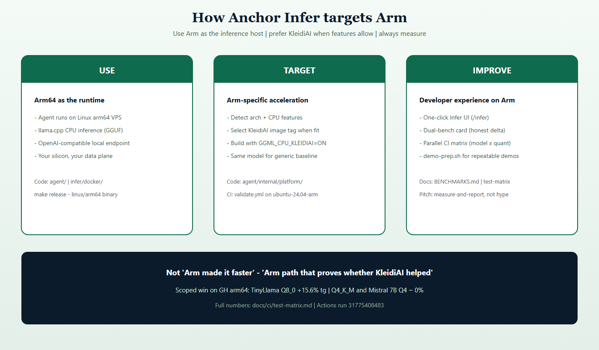
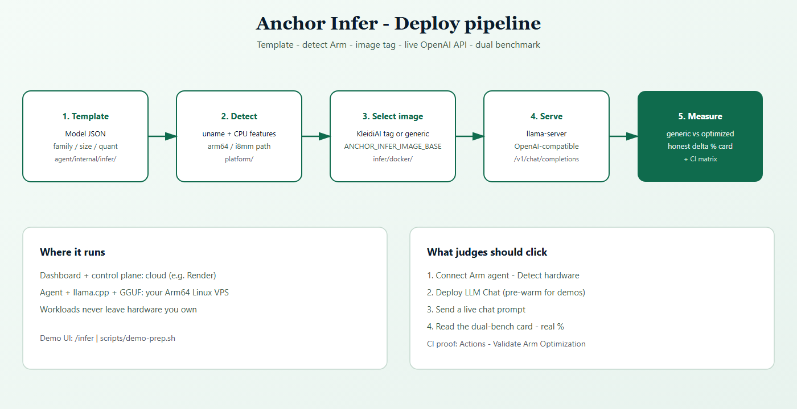
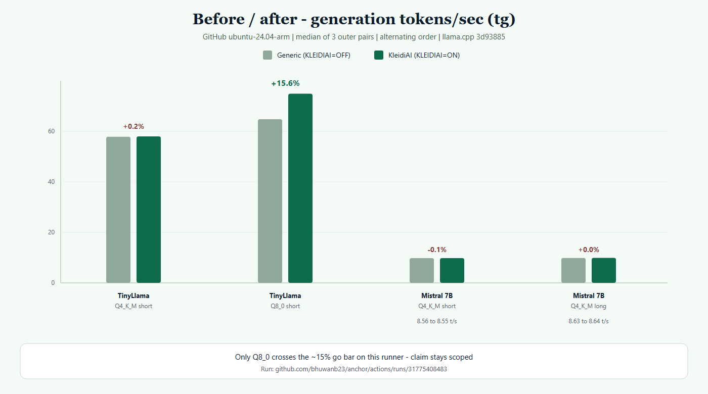
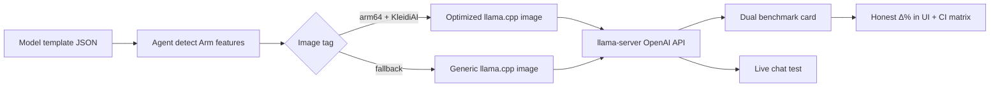

# Anchor Infer — Guide for judges

This page answers the submission checklist directly:

1. **Setup** — build, run, test, validate  
2. **Arm** — how we target and improve Arm-powered platforms  
3. **What we optimized** — model, throughput, workflow, Arm libraries  
4. **Evidence** — benchmarks, before/after, demo links, docs  

**Live demo (control plane + dashboard):**  
- Dashboard: https://anchor-web-tvir.onrender.com  
- API: https://anchor-api-o1ba.onrender.com  
- Note: free Render sleeps when idle (~1 min cold start). The **agent + model run on your Linux VPS**, not on Render.

**Proof artifacts:** [`BENCHMARKS.md`](../BENCHMARKS.md) · [`docs/ci/test-matrix.md`](ci/test-matrix.md) · [Actions Arm validate](https://github.com/bhuwanb23/anchor/actions/workflows/validate.yml)

---

## 1. Setup instructions (build · run · test · validate)

### Prerequisites

| Tool | Version |
|---|---|
| Go | 1.22+ |
| Node.js | 20+ with **pnpm** |
| Docker | for Infer runtime images + optional local agent |
| Git | clone this repo |
| (Validate) | GitHub Actions with `ubuntu-24.04-arm` runners |

### A. Local build & run (full platform)

```bash
git clone https://github.com/bhuwanb23/anchor.git
cd anchor

# Control plane + dashboard (hot reload)
cp control-plane/.env.example control-plane/.env   # edit if needed
cp agent/.env.example agent/.env                   # after first server create
make dev

# Second terminal — agent (points at local control plane)
make dev-agent
```

Then open the dashboard (typically `http://localhost:3000`), sign up, open **Servers → Add server**
(no multi-step onboarding wizard), connect a VPS, then open **Infer** (`/infer`).

Video checklist: [`DEMO.md`](../DEMO.md).

Useful Make targets:

```bash
make build    # all binaries / bundles
make test     # Go tests (agent + control plane)
make lint     # go vet + eslint
make release  # linux/amd64 + linux/arm64 agent binaries + checksums
```

### B. Hosted control plane (Render) + your Arm VPS

1. Deploy Blueprint from [`render.yaml`](../render.yaml) (see [`docs/deploy-render.md`](deploy-render.md)).  
2. Open https://anchor-web-tvir.onrender.com — wake the API if sleeping.  
3. Create an account and **connect a Linux agent** using the install command (agent must reach `https://anchor-api-o1ba.onrender.com`).  
4. Confirm API health shows `connected_agents ≥ 1`:  
   `curl -s https://anchor-api-o1ba.onrender.com/health`

### C. Infer product path (deploy a model)

```bash
# 1) Build & publish llama.cpp Infer images (generic + KleidiAI tags)
./infer/docker/build.sh ghcr.io/<you>/anchor-infer --push

# 2) On the agent host
export ANCHOR_INFER_IMAGE_BASE=ghcr.io/<you>/anchor-infer
# restart the agent so it picks up the env

# 3) Dashboard → Infer → Detect hardware → Deploy LLM Chat
# 4) Morning-of check
./scripts/demo-prep.sh \
  --control-plane=https://anchor-api-o1ba.onrender.com \
  --token=<JWT from browser localStorage> \
  --server=<server-id>
```

Product smoke (API):

```bash
./scripts/validate-infer-product.sh \
  --control-plane=https://anchor-api-o1ba.onrender.com \
  --token=<JWT> --server=<server-id>
```

### D. Validate Arm optimization (CI — no VPS required)

1. Repo → **Actions** → **Validate Arm Optimization** → **Run workflow**  
2. Suite: `full-matrix`, `outer_repeats=3`  
3. Download artifacts `arm-benchmark-*` → compare to [`docs/ci/test-matrix.md`](ci/test-matrix.md)

This builds llama.cpp twice (`GGML_CPU_KLEIDIAI=OFF` vs `ON`) on `ubuntu-24.04-arm` and runs `llama-bench`.

---

## 2. How this project uses / targets / improves Arm



**Uses Arm as the runtime for inference.** The agent prefers Arm64 hosts for Infer. Platform detection (`agent/internal/platform/`) reads architecture and CPU features (e.g. paths toward i8mm / SME-aware tags) and selects an Infer **image tag**.

**Targets Arm-specific acceleration.** Optimized images build llama.cpp with **KleidiAI** (`GGML_CPU_KLEIDIAI=ON`). Generic images use the same model without that flag — so before/after is an apples-to-apples Arm comparison, not “GPU vs CPU.”

**Improves the Arm developer path**, not only peak FLOPs:

| Improvement | What judges can point at |
|---|---|
| Arch-aware deploy | `detect_platform` → image tag selection |
| Dual-build proof | `.github/workflows/validate.yml` on arm64 runners |
| Honest reporting | Dashboard dual-bench card + CI matrix |
| Reusable pipeline | Template JSON + `infer/docker/` + workflow_dispatch suites |

We do **not** claim “Arm always makes every model 40% faster.” We claim: **on Arm, you get detect → optimized path → measured Δ**.

---

## 3. What we optimized



| Area | What we did | Artifact |
|---|---|---|
| **Model size / quant** | Matrix over TinyLlama 1.1B and Mistral 7B; Q4_K_M vs Q8_0 | `docs/ci/test-matrix.md` |
| **Throughput (tg t/s)** | Headline metric = generation tokens/sec from `llama-bench` | `BENCHMARKS.md` |
| **Prompt eval (pp)** | Recorded separately (not blended into the headline %) | matrix “informational” table |
| **Latency / TTFT** | Product path exposes live chat RTT in the dashboard test UI | `/infer` Live Endpoint |
| **Memory** | Quantized GGUF (Q4/Q8) so 7B-class fits CPU inference budgets | templates + HF GGUF |
| **Inference performance** | KleidiAI-enabled llama.cpp vs generic Arm build | CI + agent dual images |
| **Developer workflow** | One dashboard flow + parallel CI matrix + demo-prep script | scripts + `/infer` |
| **Arm libraries / frameworks** | llama.cpp + KleidiAI (`GGML_CPU_KLEIDIAI`) | `validate.yml`, `infer/docker/` |

**Prompt length:** short (−p 128 −n 64) vs long (−p 512 −n 128) on Mistral — both ~0% KleidiAI Δ on GH arm64.

**Statistical rigor:** inner `-r 3`, outer N=3 pairs, **alternating** generic↔KleidiAI order to reduce warm-up bias.

---

## 4. Benchmarks, before/after, links, docs

### Before / after (generation t/s) — GH `ubuntu-24.04-arm`, N=3



| Cell | Before (generic) | After (KleidiAI) | Δ% | Verdict |
|---|---:|---:|---:|---|
| TinyLlama Q4_K_M · short | 50.63 | 50.74 | **+0.2%** | no-go |
| TinyLlama Q8_0 · short | 56.69 | 65.55 | **+15.6%** | **go (scoped)** |
| Mistral 7B Q4_K_M · short | 8.56 | 8.55 | **−0.1%** | no-go |
| Mistral 7B Q4_K_M · long | 8.63 | 8.64 | **+0.0%** | no-go |

**Source run:** [Actions #31775408483](https://github.com/bhuwanb23/anchor/actions/runs/31775408483)

**Scoped claim only:** KleidiAI helped **TinyLlama Q8_0** (+15.6% tg) on this runner. Do not generalize to Q4_K_M or 7B on GitHub’s shared arm64 runners.

### Demo & supporting docs

| Item | Link |
|---|---|
| Live dashboard | https://anchor-web-tvir.onrender.com |
| Live API health | https://anchor-api-o1ba.onrender.com/health |
| Benchmark numbers | [`BENCHMARKS.md`](../BENCHMARKS.md) |
| Full test matrix | [`docs/ci/test-matrix.md`](ci/test-matrix.md) |
| Demo / Devpost checklist | [`docs/layers/infer-demo-devpost.md`](layers/infer-demo-devpost.md) |
| Phase 4 pre-warm notes | [`docs/layers/phase4-demo-prep.md`](layers/phase4-demo-prep.md) |
| Infer deep dive | [`docs/infer_ai_model.md`](infer_ai_model.md) |
| Render deploy | [`docs/deploy-render.md`](deploy-render.md) |

### Mermaid — end-to-end Infer graph



---

## Elevator answer for judges

> Anchor Infer productizes Arm LLM deploy: detect hardware, pick a KleidiAI-aware image when appropriate, serve an OpenAI-compatible endpoint, and **measure** generic vs optimized. On GitHub arm64 CI we saw **+15.6%** generation throughput for TinyLlama Q8_0, and ~**0%** for TinyLlama Q4_K_M and Mistral 7B Q4_K_M — so the reusable artifact is the pipeline and the honesty of the numbers, not a blanket speedup claim.
